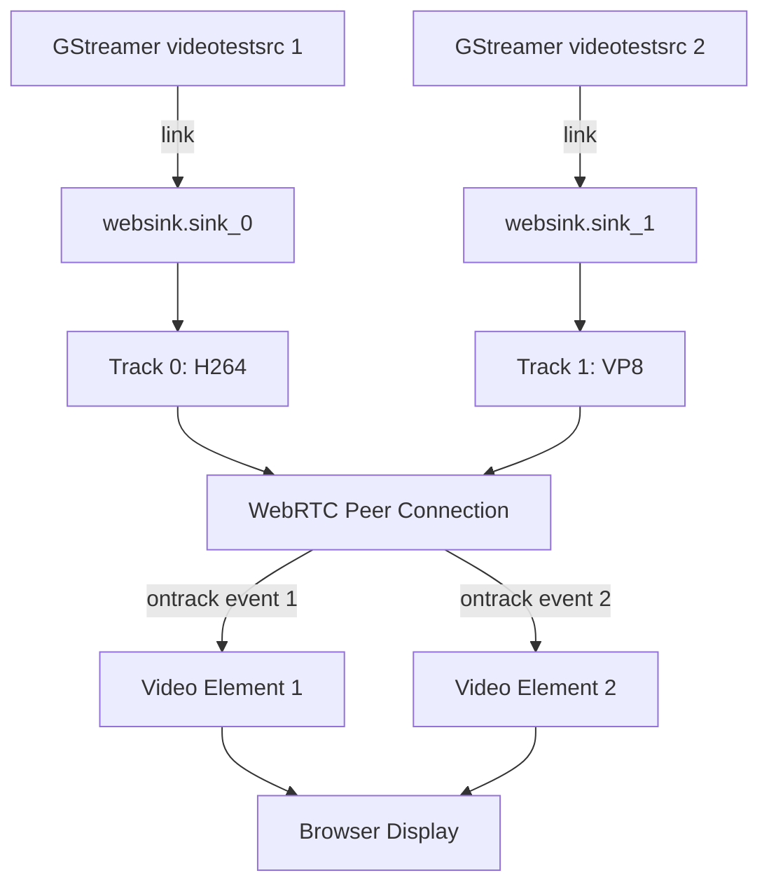

# Multi-Stream Architecture Plan

## Current Architecture Analysis

### Current Design (Single Stream)
```
GStreamer Pipeline → Single Sink Pad → Single Track → WebRTC → Single Video Element
```

**Current Implementation:**
- WebSink inherits from `BaseSink` (single sink pad)
- State contains `video_track: Option<VideoTrack>`
- `set_caps()` called once at stream start
- `render()` receives buffers from single stream
- JavaScript creates one video element

### Limitations
- ✗ Cannot accept multiple video streams
- ✗ Single pad template (always named "sink")
- ✗ State designed for one track
- ✗ No way to distinguish between multiple streams

## Proposed Architecture (Multi-Stream)

### Design Overview
```
GStreamer Pipeline → Multiple Request Pads → Multiple Tracks → WebRTC → Multiple Video Elements
                     (sink_0, sink_1, ...)
```

### Architecture Diagram



### Key Design Decision: Keep BaseSink, Use Indexing

After analysis, I propose **NOT** switching to request pads. Instead:

**Option A: Multiple WebSink Instances (Recommended)**
- Create multiple `websink` elements in the pipeline
- Each has its own sink pad
- Use shared State via a "session ID" or singleton pattern
- All tracks added to same peer connection

**Option B: Request Pads (More Complex)**
- Switch from BaseSink to Element
- Implement request pad creation
- Track pads in a HashMap
- More GStreamer boilerplate

**Recommendation: Option A** is simpler and more in line with GStreamer design patterns.

## Option A: Multi-Instance Architecture

### Pipeline Example
```bash
# Two video streams to one websink session
gst-launch-1.0 \
  videotestsrc pattern=0 ! video/x-raw,width=640,height=480 ! \
    videoconvert ! x264enc ! websink name=ws0 port=8091 session-id=main \
  videotestsrc pattern=1 ! video/x-raw,width=640,height=480 ! \
    videoconvert ! vp8enc ! websink name=ws1 port=8091 session-id=main
```

### State Management

**Global Session Registry:**
```rust
// Singleton pattern for shared sessions
lazy_static! {
    static ref SESSIONS: Arc<Mutex<HashMap<String, Arc<Mutex<SessionState>>>>> =
        Arc::new(Mutex::new(HashMap::new()));
}

pub struct SessionState {
    pub runtime: Option<Runtime>,
    pub server_handle: Option<JoinHandle<()>>,
    pub peer_connections: HashMap<String, Arc<RTCPeerConnection>>,
    pub tracks: Vec<VideoTrack>,  // All tracks for this session
    pub webrtc_config: Option<RTCConfiguration>,
}
```

**Per-Element State:**
```rust
pub struct WebSink {
    settings: Mutex<Settings>,
    session_id: Mutex<String>,  // NEW: which session to join
    track_index: Mutex<Option<usize>>,  // NEW: index in session tracks
}

struct Settings {
    port: u16,
    stun_server: String,
    is_live: bool,
    session_id: String,  // NEW: session identifier
}
```

### Workflow

1. **First websink element starts:**
   - Creates session in global registry
   - Starts HTTP server
   - Creates first track, adds to session.tracks[0]

2. **Second websink element starts:**
   - Finds existing session by session-id
   - Creates second track, adds to session.tracks[1]
   - Shares same HTTP server

3. **Client connects:**
   - Server creates peer connection
   - Adds ALL tracks from session.tracks to peer connection
   - Returns track count in response

4. **Rendering:**
   - Each element's render() writes to its own track
   - All tracks sent to all connected peers

### Session Response Update

```rust
#[derive(Serialize, Deserialize, Debug)]
pub struct SessionResponse {
    pub answer: serde_json::Value,
    pub session_id: String,
    pub tracks: Vec<TrackInfo>,  // NEW
}

#[derive(Serialize, Deserialize, Debug)]
pub struct TrackInfo {
    pub id: String,
    pub codec: String,
    pub kind: String,  // "video" or "audio"
}
```

### JavaScript Updates

```javascript
let videoElements = [];

pc.ontrack = function (event) {
  console.log(`Received ${event.track.kind} track:`, event.track);

  if (event.track.kind === 'video') {
    const videoElement = document.createElement('video');
    videoElement.srcObject = event.streams[0];
    videoElement.autoplay = true;
    videoElement.playsInline = true;
    videoElement.muted = true;
    videoElement.className = 'stream-video';

    videoElement.addEventListener('loadedmetadata', function() {
      videoElement.play().catch(e => {
        console.warn(`Autoplay failed: ${e.message}`);
      });
    });

    const videoContainer = document.getElementById('videoContainer');
    videoContainer.appendChild(videoElement);
    videoElements.push(videoElement);

    console.log(`Total video tracks: ${videoElements.length}`);
  }
}
```

### HTML/CSS Updates

```html
<div id="videoContainer" class="video-grid">
  <!-- Video elements dynamically added here -->
</div>

<style>
.video-grid {
  display: grid;
  grid-template-columns: repeat(auto-fit, minmax(320px, 1fr));
  gap: 10px;
  padding: 10px;
}

.stream-video {
  width: 100%;
  height: auto;
  background: #000;
  border: 2px solid #333;
  border-radius: 8px;
}
</style>
```

## Implementation Steps

### Phase 1: Session Registry
1. Create global session registry
2. Add session-id property to WebSink
3. Update start() to register/join sessions
4. Update stop() to leave sessions

### Phase 2: Multi-Track Management
1. Change State.video_track to Vec<VideoTrack>
2. Update create_video_track() to add to vector
3. Track element's index in session

### Phase 3: Server Updates
1. Update handle_session_request() to add all tracks
2. Add track metadata to SessionResponse
3. Return track count and IDs

### Phase 4: Client Updates
1. Update ontrack handler to support multiple tracks
2. Add CSS for video grid layout
3. Update status display for track count

### Phase 5: Testing
1. Test with two video streams
2. Test with mixed codecs (H264 + VP8)
3. Test dynamic add/remove of streams

## Alternative: Option B - Request Pads

If we want true request pads (more complex):

### Changes Required

1. **Switch from BaseSink to Element:**
```rust
impl ObjectSubclass for WebSink {
    type ParentType = gst::Element;  // Changed from BaseSink
}
```

2. **Implement Pad Management:**
```rust
struct PadState {
    pad: gst::Pad,
    track: VideoTrack,
    codec: VideoCodec,
    mode: StreamMode,
}

pub struct WebSink {
    pads: Mutex<HashMap<String, PadState>>,
    // ...
}
```

3. **Implement request_new_pad:**
```rust
impl ElementImpl for WebSink {
    fn request_new_pad(
        &self,
        templ: &gst::PadTemplate,
        name: Option<&str>,
        caps: Option<&gst::Caps>,
    ) -> Option<gst::Pad> {
        // Create new sink pad
        // Create associated track
        // Add pad to element
    }

    fn release_pad(&self, pad: &gst::Pad) {
        // Remove track
        // Remove pad
    }
}
```

4. **Update Pad Template:**
```rust
gst::PadTemplate::new(
    "sink_%u",  // Request pad template
    gst::PadDirection::Sink,
    gst::PadPresence::Request,  // Changed from Always
    &combined_caps
)
```

This approach is more complex but more "proper" GStreamer design.

## Recommendation

**Start with Option A (Multi-Instance)** because:
- ✅ Simpler implementation
- ✅ Less GStreamer boilerplate
- ✅ Easier to test incrementally
- ✅ Follows GStreamer patterns (e.g., x264enc, vp8enc are separate)
- ✅ Can migrate to Option B later if needed

**Use Option B (Request Pads)** if:
- Need dynamic pad creation at runtime
- Want single element in pipeline
- Building a complex mixer/muxer

## Testing Strategy

### Test Case 1: Two H.264 Streams
```bash
gst-launch-1.0 \
  videotestsrc pattern=0 ! videoconvert ! x264enc ! \
    websink name=ws0 port=8091 session-id=test \
  videotestsrc pattern=1 ! videoconvert ! x264enc ! \
    websink name=ws1 port=8091 session-id=test
```

### Test Case 2: Mixed Codecs
```bash
gst-launch-1.0 \
  videotestsrc pattern=0 ! videoconvert ! x264enc ! \
    websink name=ws0 port=8091 session-id=test \
  videotestsrc pattern=1 ! videoconvert ! vp8enc ! \
    websink name=ws1 port=8091 session-id=test
```

### Test Case 3: Different Resolutions
```bash
gst-launch-1.0 \
  videotestsrc ! video/x-raw,width=1280,height=720 ! videoconvert ! x264enc ! \
    websink name=ws0 port=8091 session-id=test \
  videotestsrc ! video/x-raw,width=640,height=480 ! videoconvert ! x264enc ! \
    websink name=ws1 port=8091 session-id=test
```

## Migration Path

Existing single-stream pipelines continue to work:
- Default session-id = "default"
- Single track behaves as before
- No breaking changes

## Summary

Multi-stream support enables:
- ✅ Multiple camera feeds
- ✅ Picture-in-picture
- ✅ Split-screen views
- ✅ Multi-angle streaming
- ✅ Mixed codec streaming

Next step: Implement Option A (Multi-Instance) architecture.