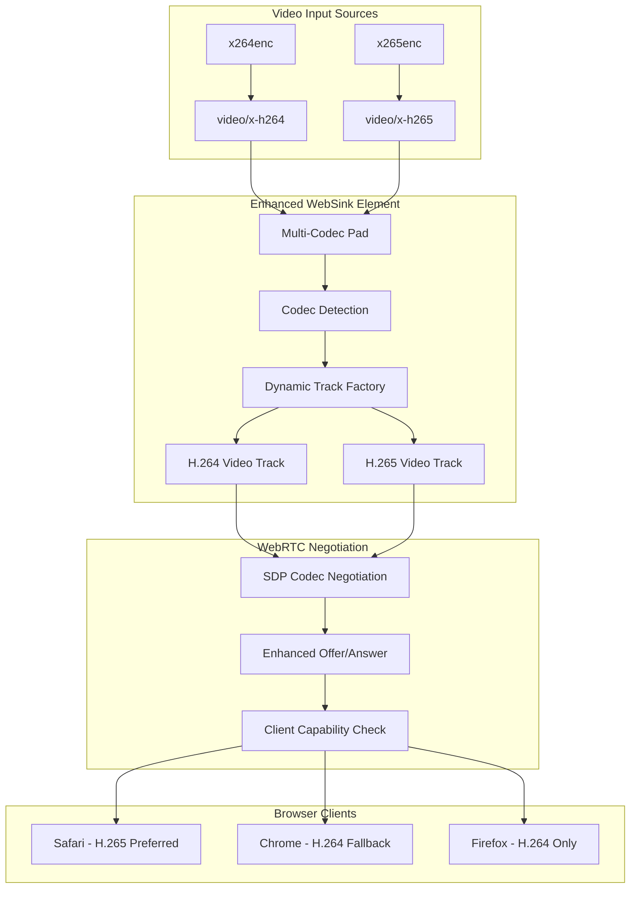

# WebRTC WebSink GStreamer Plugin

A GStreamer plugin that allows streaming directly to web browsers using WebRTC with **automatic codec negotiation**. This plugin is available in both Go and Rust implementations, and uses [Pion](https://github.com/pion/webrtc) and [WebRTC.rs](https://webrtc.rs/) respectively, instead of the native gstreamer webrtc implementation. It creates a complete streaming solution by combining:

- A GStreamer sink element that handles **H.264 and H.265/HEVC** video streaming via WebRTC
- **Automatic codec negotiation** based on browser capabilities
- An HTTP server that serves the client webpage with codec detection
- HTTP-based WebRTC signalling for establishing peer connections
- Client-side HTML/JS with codec capability detection and fallback support

The application supports multiple simultaneous client connections, with each client receiving the same video stream using the optimal codec.

## 🎥 Codec Support

### Currently Supported
- **H.264** - Universal browser support (Chrome, Firefox, Safari, Edge)
- **H.265/HEVC** - Safari, limited Chrome support (experimental), better compression

### Browser Compatibility Matrix

| Browser | H.264 Support | H.265/HEVC Support | Auto-Negotiation |
|---------|---------------|-------------------|------------------|
| Safari | ✅ Full | ✅ Full | ✅ Prefers H.265 |
| Chrome | ✅ Full | 🔬 Experimental* | ✅ Falls back to H.264 |
| Firefox | ✅ Full | ❌ None | ✅ Uses H.264 |
| Edge | ✅ Full | 🔬 Limited | ✅ Falls back to H.264 |

*Chrome H.265 support requires enabling experimental features

### Automatic Codec Selection
The plugin automatically negotiates the best codec:
1. **Safari** → H.265 preferred for better compression
2. **Chrome** → H.264 (unless experimental H.265 enabled)
3. **Firefox** → H.264 only
4. **Fallback** → H.264 for maximum compatibility

> [!WARNING]
> This code is considered Alpha as it implements a subset of functionality.
> - Future work:
>   - Add support for RTP packet data, and muxed audio/video streams
>   - Add support for VP8/VP9 codecs
>   - Add support for multiple video tracks

## Building the Plugin

### Go Implementation

```bash
# Install the gst-plugin-gen tool
go install github.com/go-gst/go-gst/cmd/gst-plugin-gen@latest

# Generate bindings
go generate

# Build the GStreamer plugin
go build -o libwebsink.so -buildmode c-shared .
```

### Rust Implementation

```bash
# Build the GStreamer plugin
cargo build --release
```

## Testing the Plugin

These steps work with either the Go or Rust implementation:

```bash
# Add the plugin to the GStreamer plugin path
export GST_PLUGIN_PATH=$PWD:$GST_PLUGIN_PATH

# Clear GStreamer registry cache (if needed)
rm -rf ~/.cache/gstreamer-1.0/

# Verify the plugin is available
gst-inspect-1.0 websink

# Run H.264 test pipeline (universal compatibility)
gst-launch-1.0 videotestsrc ! video/x-raw,format=I420 ! x264enc speed-preset=ultrafast tune=zerolatency key-int-max=20 ! video/x-h264,stream-format=byte-stream ! websink

# Run H.265 test pipeline (Safari recommended)
gst-launch-1.0 videotestsrc ! video/x-raw,format=I420 ! x265enc speed-preset=ultrafast tune=zerolatency key-int-max=20 ! video/x-h265,stream-format=byte-stream ! websink
```

After running the test pipeline, open your web browser to http://localhost:8091 to view the stream.

### Rust Integration Tests

```bash
# Run all codec tests
cargo test

# Test specific codec features
cargo test test_h264_codec_specific_features -- --nocapture
cargo test test_h265_codec_specific_features -- --nocapture

# Test streaming pipelines
cargo test test_h264_streaming_pipeline -- --nocapture
cargo test test_h265_streaming_pipeline -- --nocapture

# Test codec negotiation
cargo test test_codec_negotiation -- --nocapture
```

## Properties

This plugin creates a webserver with HTTP-based signaling and automatic codec negotiation. It accepts both H.264 and H.265 video input and handles WebRTC streaming to multiple clients with optimal codec selection.

### Multi-Codec Architecture



Available properties:

- `port`: HTTP server port (default: 8091, 0 for auto-selection)
- `stun-server`: STUN server URI (default: stun:stun.l.google.com:19302)
- `is-live`: Whether to block Render without peers (default: false)

## Testing

### Multi-Codec Rust Tests

The plugin includes comprehensive Rust integration tests for both H.264 and H.265 codecs:

```bash
# Run all integration tests
cargo test -- --nocapture

# H.264 specific tests
cargo test h264_integration_test -- --nocapture

# H.265 specific tests (gracefully handles missing x265enc)
cargo test h265_integration_test -- --nocapture

# Multi-codec negotiation tests
cargo test multi_codec_test -- --nocapture
```

**Test Coverage:**
- ✅ Codec capability detection and caps acceptance
- ✅ Dynamic video track creation for each codec
- ✅ Complete GStreamer pipeline validation
- ✅ WebRTC session establishment and negotiation
- ✅ Graceful fallback when encoders are unavailable

### Browser Tests

Both implementations use Selenium tests to confirm valid video on multiple browsers:

```bash
# Install the required Python packages
pip install pytest-selenium webdriver-manager opencv-python

# Run browser tests
pytest

# Test with specific browsers
pytest -k "chrome"  # Chrome tests
pytest -k "firefox" # Firefox tests
```

### Manual Testing

```bash
# Test H.264 streaming
./test_h264.sh
# Open http://localhost:8092 in any browser

# Test H.265 streaming
./test_h265.sh
# Open http://localhost:8093 in Safari for best experience
```

## Requirements

### System Dependencies (For both implementations)

The following packages are required for building and testing the project. On Ubuntu/Debian systems:

```bash
sudo apt-get install \
  gir1.2-gst-plugins-base-1.0 \
  libgirepository-2.0-dev \
  libglib2.0-dev \
  python3-pip \
  libgstreamer1.0-dev \
  libgstreamer-plugins-base1.0-dev \
  libgstreamer-plugins-bad1.0-dev \
  gstreamer1.0-plugins-base \
  gstreamer1.0-plugins-good \
  gstreamer1.0-plugins-bad \
  gstreamer1.0-plugins-ugly \
  gstreamer1.0-libav \
  gstreamer1.0-tools \
  gstreamer1.0-x \
  gstreamer1.0-alsa \
  gstreamer1.0-gl \
  gstreamer1.0-gtk3 \
  gstreamer1.0-qt5 \
  gstreamer1.0-pulseaudio
```

For testing:

```bash
pip3 install pytest-selenium pytest webdriver-manager opencv-python
```

Additionally, Firefox or Chrome/Chromium browsers are required for the Selenium tests.

### Go Implementation
- Go 1.23+
- go-gst (Go bindings for GStreamer)
- pion/webrtc (Go WebRTC implementation)

### Rust Implementation (Enhanced Multi-Codec)
- Rust 1.70+
- Cargo
- gstreamer-rs (Rust bindings for GStreamer)
- webrtc-rs (Rust WebRTC implementation with H.264/H.265 support)

### Additional Codecs
For H.265/HEVC support, install:
```bash
# Ubuntu/Debian
sudo apt install gstreamer1.0-plugins-bad gstreamer1.0-plugins-ugly

# Or build x265 from source for latest features
```

## License

MIT