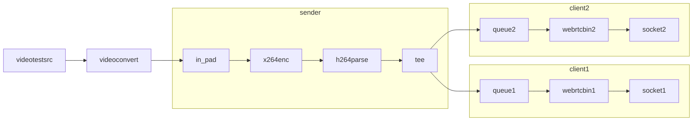

# WebRTCWebSink GStreamer Plugin

A GStreamer plugin that allows streaming directly to web browsers using WebRTC. This plugin creates a complete streaming solution by combining:

- A GStreamer bin element that handles WebRTC streaming
- An HTTP server that serves the client webpage
- A WebSocket server for WebRTC signaling
- Client-side HTML/JS for receiving and displaying the stream

## Installation

```bash
pip install .
```

## Usage

```python
import gi
gi.require_version('Gst', '1.0')
from gi.repository import Gst

Gst.init(None)

# Create a simple pipeline
pipeline = Gst.parse_launch('''
    videotestsrc is-live=true ! videoconvert ! webrtcwebsink
''')

# Start playing
pipeline.set_state(Gst.State.PLAYING)

# Open your web browser to http://localhost:8080 to view the stream
```

## Properties

This plugin creates a webserver with signaling server, and sends the video to the clients connected. Its intended for use with embedded devices, so the codec preferences of the sender are preffered, and only one encoder is used. Each client gets its own queue and webrtcbin connected to the common encoder+parser combo.

Diagram:



- `port`: HTTP server port (default: 8080)
- `ws-port`: WebSocket server port (default: 8081)
- `bind-address`: Network interface to bind to (default: 0.0.0.0)
- `stun-server`: STUN server URI (default: stun://stun.l.google.com:19302)

## Testing

Run the included test application:

```bash
python3 ./run_websink.py
```

Run pytest to test the plugin:

```bash
pytest
```

Then open your web browser to http://localhost:8080 to view the test stream.

## Requirements

- Python 3.7+
- GStreamer 1.0 with WebRTC support
- Python packages: websockets, pygobject

## License

LGPL-2.1