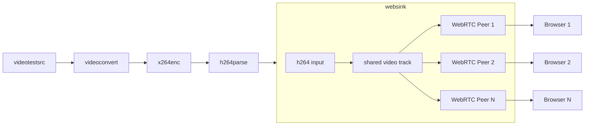

# WebRTC WebSink GStreamer Plugin

A Go-based GStreamer plugin that allows streaming directly to web browsers using WebRTC. This plugin creates a complete streaming solution by combining:

- A GStreamer sink element that handles H264 video streaming via WebRTC
- An HTTP server that serves the client webpage
- HTTP-based WebRTC signaling for establishing peer connections
- Client-side HTML/JS for receiving and displaying the stream

The application supports multiple simultaneous client connections, with each client receiving the same video stream.

## Building the Plugin

```bash
# Install the gst-plugin-gen tool
go install github.com/go-gst/go-gst/cmd/gst-plugin-gen@latest

# Generate bindings
go generate

# Build the GStreamer plugin
go build -o libwebsink.so -buildmode c-shared .
```

## Testing the Plugin

```bash
# Add the plugin to the GStreamer plugin path
export GST_PLUGIN_PATH=$PWD:$GST_PLUGIN_PATH

# Clear GStreamer registry cache (if needed)
rm -rf ~/.cache/gstreamer-1.0/

# Verify the plugin is available
gst-inspect-1.0 websink

# Run a test pipeline
gst-launch-1.0 videotestsrc ! video/x-raw,format=I420 ! x264enc speed-preset=ultrafast tune=zerolatency key-int-max=20 ! video/x-h264,stream-format=byte-stream ! websink
```

After running the test pipeline, open your web browser to http://localhost:8091 to view the stream.

## Properties

This plugin creates a webserver with HTTP-based signaling, and sends H264 video to connected clients. It's intended for use with embedded devices, so the codec preferences of the sender are preferred. The plugin accepts H264 video input and handles the WebRTC streaming to multiple clients.

Architecture Diagram:



Available properties:

- `port`: HTTP server port (default: 8091, 0 for auto-selection)
- `stun-server`: STUN server URI (default: stun:stun.l.google.com:19302)
- `is-live`: Whether to block Render without peers (default: false)

## File Structure

- `websink.go` - Main Go application that turns into the C shared library libwebsink.so
- `static/` - Client-side web files
  - `index.html` - Main webpage with minimal UI focused on video display
  - `stream.js` - Client-side WebRTC implementation

## Testing

Selenium test to confirm valid video on firefox and chrome. Uses opencv for crude image comparison.

```bash
pip install pytest-selenium webdriver-manager
pytest
```

## Requirements

- Go 1.23+
- GStreamer 1.22+
- go-gst (Go bindings for GStreamer)
- pion/webrtc (Go WebRTC implementation)

## License

MIT