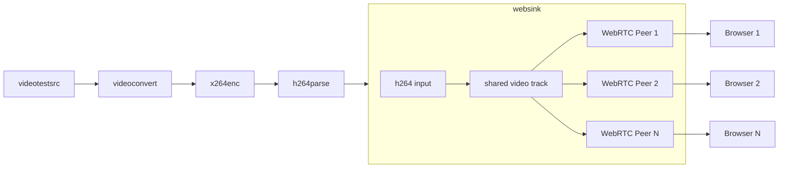

# WebRTC WebSink GStreamer Plugin

A GStreamer plugin that allows streaming directly to web browsers using WebRTC. This plugin is available in both Go and Rust implementations, and uses [Pion](https://github.com/pion/webrtc) and [WebRTC.rs](https://webrtc.rs/) respectively, instead of the native gstreamer webrtc implementation. It creates a complete streaming solution by combining:

- A GStreamer sink element that handles H264 video streaming via WebRTC
- An HTTP server that serves the client webpage
- HTTP-based WebRTC signalling for establishing peer connections
- Client-side HTML/JS for receiving and displaying the stream

The application supports multiple simultaneous client connections, with each client receiving the same video stream.

> [!WARNING]
> This code is considered Alpha as it implements a very simple subset of functionality.
> - Future work:
>   - Add support for RTP packet data, and muxed audio/video streams
>   - Add support for more codecs (e.g., VP8, VP9) (browser support permitting)
>   - Add support for multiple video tracks

## Building the Plugin

### Go Implementation

```bash
# Install the gst-plugin-gen tool
go install github.com/go-gst/go-gst/cmd/gst-plugin-gen@latest

# Generate bindings
go generate

# Build the GStreamer plugin
go build -o libwebsink.so -buildmode c-shared .
```

### Rust Implementation

```bash
# Build the GStreamer plugin
cargo build --release
```

## Testing the Plugin

These steps work with either the Go or Rust implementation:

```bash
# Add the plugin to the GStreamer plugin path
export GST_PLUGIN_PATH=$PWD:$GST_PLUGIN_PATH

# Clear GStreamer registry cache (if needed)
rm -rf ~/.cache/gstreamer-1.0/

# Verify the plugin is available
gst-inspect-1.0 websink

# Run a test pipeline
gst-launch-1.0 videotestsrc ! video/x-raw,format=I420 ! x264enc speed-preset=ultrafast tune=zerolatency key-int-max=20 ! video/x-h264,stream-format=byte-stream ! websink
```

After running the test pipeline, open your web browser to http://localhost:8091 to view the stream.

## Properties

This plugin creates a webserver with HTTP-based signaling, and sends H264 video to connected clients. It's intended for use with embedded devices, so the codec preferences of the sender are preferred. The plugin accepts H264 video input and handles the WebRTC streaming to multiple clients.

Architecture Diagram:



Available properties:

- `port`: HTTP server port (default: 8091, 0 for auto-selection)
- `stun-server`: STUN server URI (default: stun:stun.l.google.com:19302)
- `is-live`: Whether to block Render without peers (default: false)

## Testing

Both implementations use the same Selenium tests to confirm valid video on Firefox and Chrome. The tests use OpenCV for basic image comparison.

```bash
# Install the required Python packages
pip install pytest-selenium webdriver-manager opencv-python

# Run the tests
pytest
```

## Requirements

### System Dependencies (For both implementations)

The following packages are required for building and testing the project. On Ubuntu/Debian systems:

```bash
sudo apt-get install \
  gir1.2-gst-plugins-base-1.0 \
  libgirepository-2.0-dev \
  libglib2.0-dev \
  python3-pip \
  libgstreamer1.0-dev \
  libgstreamer-plugins-base1.0-dev \
  libgstreamer-plugins-bad1.0-dev \
  gstreamer1.0-plugins-base \
  gstreamer1.0-plugins-good \
  gstreamer1.0-plugins-bad \
  gstreamer1.0-plugins-ugly \
  gstreamer1.0-libav \
  gstreamer1.0-tools \
  gstreamer1.0-x \
  gstreamer1.0-alsa \
  gstreamer1.0-gl \
  gstreamer1.0-gtk3 \
  gstreamer1.0-qt5 \
  gstreamer1.0-pulseaudio
```

For testing:

```bash
pip3 install pytest-selenium pytest webdriver-manager opencv-python
```

Additionally, Firefox or Chrome/Chromium browsers are required for the Selenium tests.

### Go Implementation
- Go 1.23+
- go-gst (Go bindings for GStreamer)
- pion/webrtc (Go WebRTC implementation)

### Rust Implementation
- Rust 1.70+
- Cargo
- gstreamer-rs (Rust bindings for GStreamer)
- webrtc-rs (Rust WebRTC implementation)

## License

MIT